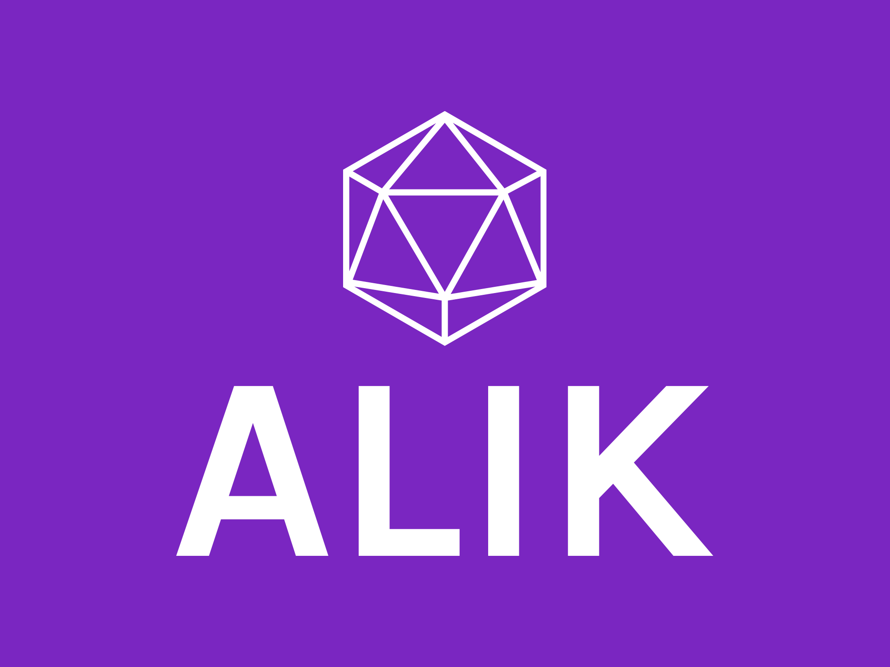

* I'm lexBenji, creator of `Alik <https://github.com/lexBenji/alik>`_.
* My dream is to make a real OS (Operating System) and a programming language.
* I have learned `lua <https://lua.org>`_, `python <https://python.org>`_, `java <https://java.com/en>`_ and c.

